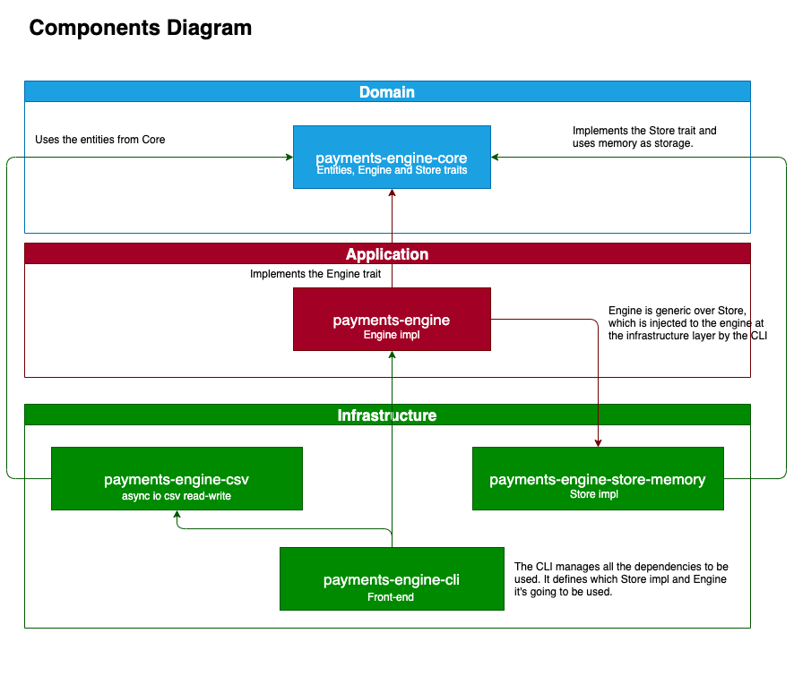

# Payments Engine

This project showcases a simple payments engine made with Rust that processes transactions and offers information about the current balance of the accounts.

## How to run the CLI

The `payments-engine-cli` binary reads a CSV file with transactions and outputs the current balance of each account to the std out.

If you want to run it, you can use the following command:

```sh
cargo run -- transactions.csv
# or this, if you want to get that info piped into a file
cargo run -- transactions.csv > accounts.csv
```

Note that there's already a `transactons.csv` file in the repository if you're curious about the kind of input you should be using.

You should get something similar to this as a response:

```csv
client,available,held,total,locked
2,0,0,0,true
1,250.0001,0,250.0001,false
```

## Architecture

The project is separated in several `crates`.

There are several reasons for that:

1. Making the compilation faster while developing.
1. Making the project more modular.
1. Helping the project to be more maintainable and extensible.
1. Making it easy to split responsibilities and avoid unwanted coupling.

The idea was to provide a **clean architecture**.

In order to do that, we defined a `Domain` layer exposing domain entities and some `core traits` to be implemented in the other layers.

Basically, we have a `Store` trait which is responsible for persistence and a `Engine` trait which is responsible for the business logic.

The current implementation just exposes an `In-Memory` store and a simple `Engine` according to some specific business rules but, as we have everything decoupled, we could easily extend this project to provide different kinds of stores (`PosgreSQL`, `Redis`, even a REST API, etc.) and different kinds of engines with some particular logic.

At the same time, we're using an `async CSV reader/writer` to input and output the information but this could be easily changed to any other kind of data source for the same reasons stated above.

Find below a `Component Diagram` illustrating the architecture.



## Async

The project makes extense uses of `futures` to avoid blocking scenarios as much as possible and although it uses [Tokio](https://docs.rs/tokio/latest/tokio/) for testing purposes, it's not required in order to implement the `Store` or the `Engine` traits, so you could potentially use [async-std](https://docs.rs/async-std/latest/async-std/) instead.

Indeed, [Tokio](https://docs.rs/tokio/latest/tokio/) it's only a hard dependency in the `cli` crate and the `csv reader/writer` crate.

One of the ideas was to provide a feature for at least the `csv reader/writer` crate to be able to use some other async runtime but I kept it out of the scope for the time being.

On the other hand, we're also using [async-trait](https://docs.rs/async-trait/latest/async_trait/) to simplify dealing with `traits` and `futures`.

## Testing

All the different components have their own `tests` to make sure they work as expected.

I put special emphasis on the `payments-engine` crate, as this is the crate holding all the business logic, but all of them are pretty well covered.

Precisely, given that `testing` was an important part of this project, leveraging `traits` in order to avoid implementation coupling helped a lot.

## Observability

All the libraries used in this project are using [tracing](https://docs.rs/tracing/latest/tracing/) to provide observability.

The `cli` has a subscriber that will output all the traces to the std out if the `RUST_LOG` env var is set.

You can either set it yourself or add an `.env` file to your project with the following content, as we're leveraging the [dotenv](https://docs.rs/dotenv/latest/dotenv/) crate to read the `.env` file and set the `RUST_LOG` env var.

```sh
RUST_LOG=debug
```

## Error handling

The project uses the usual suspects when dealing with `errors`:

- [thiserror](https://docs.rs/thiserror/latest/thiserror/): to easily create custom `Error` types.
- [anyhow](https://docs.rs/anyhow/latest/anyhow/): for easily handling errors in the CLI.

Generally speaking, both in the libraries and in the cli binary, all the errors are being traced.

That being said, according to the specs, the CLI ignores the serde errors and processing errors from the Engine. It only panics in case there's an error while writing the output.

## Other considerations

- In order to keep the decimal precision up to four places past the decimal and avoid possible rounding issues I decided to use the [`rust_decimal`](https://docs.rs/rust_decimal/latest/rust_decimal/) crate.
- I tried to favour static vs dynamic dispatch as much as possible where it made sense.
- The different crates are comprehensively documented in order to help both end-users and developers alike. This improves maintainability and helps people to reason about different functions and design decisions.
- I used several tools while developing like [clippy](https://github.com/rust-lang/rust-clippy), [cargo-make](https://github.com/sagiegurari/cargo-make) and [cargo-watch](https://github.com/watchexec/cargo-watch).
- The order of the rows in the output CSV file is not guaranteed.
